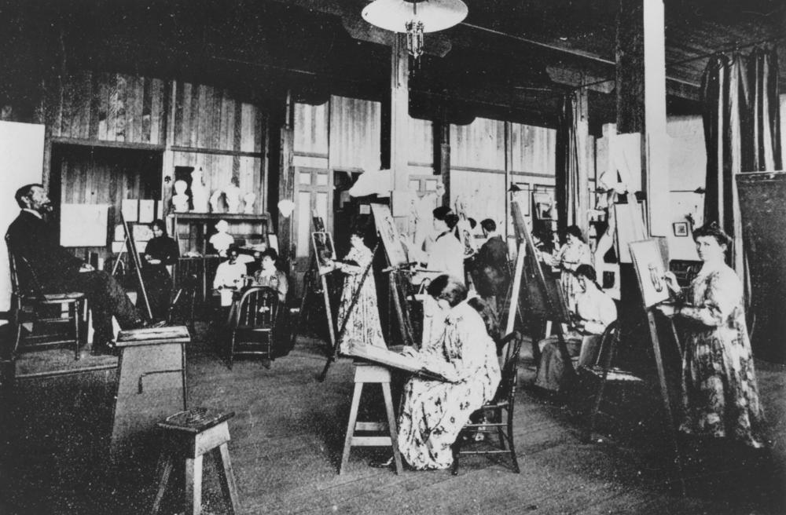
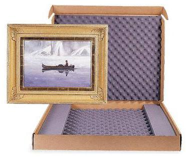
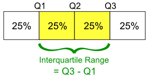

# Basic plotting systems
1. Base graphics: constructed piecemeal. Conceptually simpler and allows plotting to mirror the thought process.
2. Lattice graphics: entire plots created in a simple function call.
3. ggplot2 graphics: an implementation of the Grammar of Graphics by Leland Wikinson. Combines concepts from both base and lattice graphics. (Need to install ggplot2 library)
4. Fancier and more telling ones.

A list of interactive visualization in R can be found at: http://ouzor.github.io/blog/2014/11/21/interactive-visualizations.html

---

## Base plotting system

```{r, fig.width=6, fig.height=5}
library(datasets)
## scatter plot
plot(x = airquality$Temp, y = airquality$Ozone)
```

***

## Base plotting system
```{r, fig.width=15, fig.height=4.5}
## par() function is used to specify global graphics parameters that affect all plots in an R session.
## Type ?par to see all parameters
par(mfrow = c(1, 2), mar = c(4, 4, 2, 1), oma = c(0, 0, 2, 0))
with(airquality, {
	plot(Wind, Ozone, main="Ozone and Wind")
	plot(Temp, Ozone, main="Ozone and Temperature")
	mtext("Ozone and Weather in New York City", outer=TRUE)})
```

***

## Plotting functions (high level)


**PHASE ONE: Mount a canvas panel on the easel, and draw the draft.** (Initialize a plot.)

* plot(): one of the most frequently used plotting functions in R.
* boxplot(): a boxplot show the distribution of a vector. It is very useful to example the distribution of different variables.
* barplot(): create a bar plot with vertical or horizontal bars.
* hist(): compute a histogram of the given data values.
* pie(): draw a pie chart.

Remember to use ?plot or str(plot), etc. to check the arguments when you want to make more personalized plots. A tutorial of base plotting system with more details: http://bcb.dfci.harvard.edu/~aedin/courses/BiocDec2011/2.Plotting.pdf

***

## Plotting functions (low level)


**PHASE TWO: Add more details on your canvas, and make an artwork.** (Add more on an existing plot.)

* lines: adds liens to a plot, given a vector of x values and corresponding vector of y values
* points: adds a point to the plot
* text: add text labels to a plot using specified x,y coordinates
* title: add annotations to x,y axis labels, title, subtitles, outer margin
* mtext: add arbitrary text to margins (inner or outer) of plot
* axis: specify axis ticks

***

## Save your artwork

R can generate graphics (of varying levels of quality) on almost any type of display or printing device. Like:

* postscript(): for printing on PostScript printers, or creating PostScript graphics files.
* pdf(): produces a PDF file, which can also be included into PDF files.
* jpeg(): produces a bitmap JPEG file, best used for image plots.

help(Devices) for a list of them all. Simple example:
```{r}
## png(filename = 'plot1.png', width = 480, height = 480, units = 'px')
## plot(x, y)
## dev.off()
```

***

## Example: boxplot and hitogram



```{r, fig.width=8, fig.height=4.5}
## the layout
par(mfrow = c(2, 1), mar = c(2, 0, 2, 0), oma = c(0, 0, 0, 0))
## histogram at the top
hist(airquality$Ozone, breaks=12, main = "Histogram of Ozone")
## box plot below for comparison
boxplot(airquality$Ozone, horizontal=TRUE, main = "Box plot of Ozone")
```

---

## Lattice plotting system
```{r, fig.width=15, fig.height=4.5}
library(lattice) # need to load the lattice library
set.seed(10) # set the seed so our plots are the same
x <- rnorm(100)
f <- rep(1:4, each = 25) # first 25 elements are 1, second 25 elements are 2, ...
y <- x + f - f * x+ rnorm(100, sd = 0.5)
f <- factor(f, labels = c("Group 1", "Group 2", "Group 3", "Group 4"))
# first 25 elements are in Group 1, second 25 elements are in Group 2, ...
xyplot(y ~ x | f)
```

***

## Lattice plotting system
Want more on the plot? Customize the panel funciton:
```{r, fig.keep = 'none'}
xyplot(y ~ x | f, panel = function(x, y, ...) {
    # call the default panel function for xyplot
    panel.xyplot(x, y, ...)
    # adds a horizontal line at the median
    panel.abline(h = median(y), lty = 2)
    # overlays a simple linear regression line
    panel.lmline(x, y, col = 2) 
})
```

***

## Lattice plotting system
```{r, echo=FALSE}
xyplot(y ~ x | f, panel = function(x, y, ...) {
    # call the default panel function for xyplot
    panel.xyplot(x, y, ...)
    # adds a horizontal line at the median
    panel.abline(h = median(y), lty = 2)
    # overlays a simple linear regression line
    panel.lmline(x, y, col = 2) 
})
```

***

## Lattice plotting system
Plotting functions
* xyplot():  main function for creating scatterplots
* bwplot():  box and whiskers plots (box plots)
* histogram():  histograms
* stripplot():  box plot with actual points
* dotplot():  plot dots on "violin strings"
* splom():  scatterplot matrix (like pairs() in base plotting system)
* levelplot()/contourplot():  plotting image data

***

## Very useful when we want a lot...
```{r}
pairs(iris) ## iris is a data set in R
```

---

## ggplot2 
* An implementation of the Grammar of Graphics by Leland Wikinson
* Written by Hadley Wickham (while he was a graduate student as lowa State)
* A "third" graphics system for R (along with base and lattice)  
	Available from CRAN via install.packages()  
	web site: http://ggplot2.org (better documentation)
* Grammar of graphics represents the abstraction of graphics ideas/objects  
  Think "verb", "noun", "adjective" for graphics  
  "Shorten" the distance from mind to page
* Two main functions:  
  **qplot()** hides what goes on underneath, which is okay for most operations
  **ggplot()** is the core function and very flexible for doing this qplot() cannot do

***

## qplot function
The qplot() function is the analog to plot() but with many build-in features  
Syntax somewhere in between base/lattice  
Difficult to be customized (don't bother, use full ggplot2 power in that case)
```{r, fig.width=8, fig.height=3}
library(ggplot2) ## need to install and load this library
qplot(displ, hwy, data = mpg, facets = .~drv)
```

***

## ggplot function
When building plots in ggplot2 (ggplot, rather than using qplot)  
The "artist's palette" model may be the closest analogy  
Plots are built up in layers  
* Step I: Input the data  
**noun**: the data
```{r}
library(ggplot2) ## need to install and load this library
g <- ggplot(iris, aes(Sepal.Length, Sepal.Width)) ## this would not show you add plot
```

***

## ggplot function
* Step II: Add layers  
**adjective**: describe the type of plot you will produce.
```{r, fig.width=12, fig.height=4.5}
g + geom_point() + geom_smooth(method = "lm") + facet_grid(. ~ Species)
```

***

## ggplot function
* Step III: Add metadata and annotation  
**adjective**: control the mapping between data and aesthetics.
```{r, fig.width=12, fig.height=4.5}
g <- g + geom_point() + geom_smooth(method = "lm") + facet_grid(. ~ Species)  
g + ggtitle("Sepal length vs. width for different species") + theme_bw() ## verb
```

***

## Great documentation
Great **documentation** of ggplot with all functions in **step II** and **III** and demos:  
http://docs.ggplot2.org/current/

---

# Interactive visualization in R - rCharts
* What is rCharts?  
  Is an R package to create, customize and publish interactive javascript visualizations from R using a familiar lattice style plotting interface.

* What rCharts can make and how?  
  Quick start at: http://ramnathv.github.io/rCharts/

* A list of interactive visualization in R can be found at:  
  http://ouzor.github.io/blog/2014/11/21/interactive-visualizations.html
